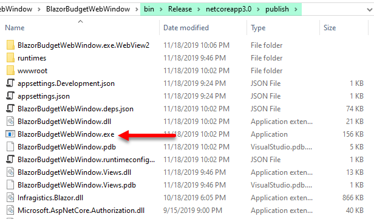
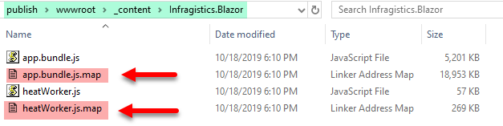
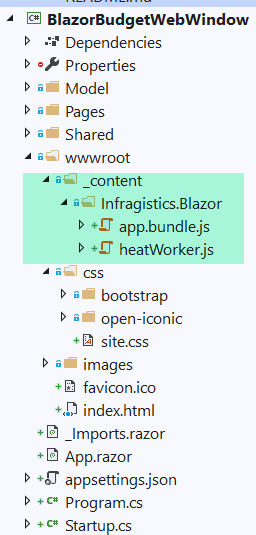

# Blazor Budget Web Window
A Blazor Budget app, featuring Infragistics Blazor Charts, running in Steve Sanderson's WebWindow!

## Documentation
**Steve Sanderson's Blog Post - MUST READ**

<a href="https://blog.stevensanderson.com/2019/11/18/2019-11-18-webwindow-a-cross-platform-webview-for-dotnet-core/" target="_blank">Meet WebWindow, a cross-platform webview library for .NET Core</a>

WebWindow, it's like Electron, but without bundling Node.js or Chromium, and without most of the the APIs.

## REQUIREMENTS
On **Windows**, you MUST install Chromium Edge. 

<a href="https://www.microsoftedgeinsider.com/en-us/?form=MD18G6&OCID=MD18G6>" target="_blank">Download Chromium Edge</a>

## Build and Run
Download or clone the repo and run it inside Visual Studio.

## Publish
You can publish the app by right clicking the project title and from the context menu select publish.

You can run the app by double clicking the `BlazorBudgetWebWindow.exe` file as pictured below.

You can also copy the entire `publish` folder to another directory and run it from there.

### After Publishing
If you want to copy the `publish` folder be sure to delete the two `.map` files pictured below. These are not needed.

## 3rd Party NuGet Content Files
Third party NuGet Packages, such as the `Infragistics.Blazor` package contain JavaScript files. Infragistics ships two JavaScript files as pictured above in the After Publishing section.

In order for this program to be debugged, we must add the two JavaScript files as pictured below so that they will be available when running inside Visual Studio.

